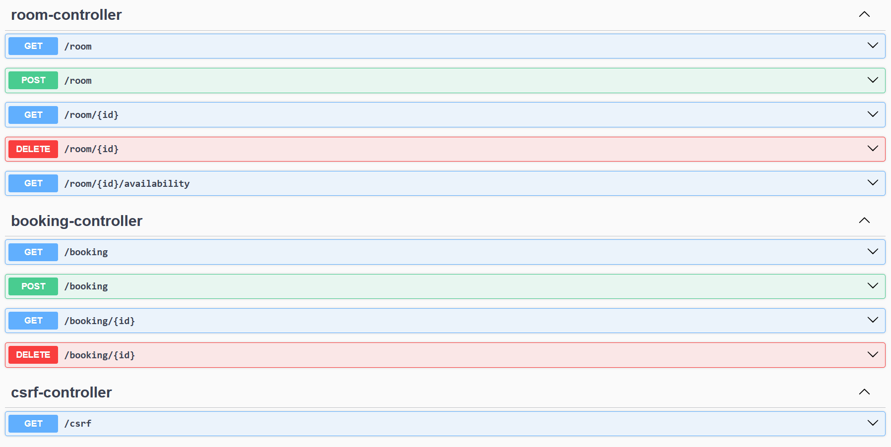

# Room Booking System

Enterprise meeting room booking API running on AWS. Handles room reservations with conflict detection and production-ready infrastructure.

## Features

- **Room Management**: Create, view, and delete meeting rooms
- **Booking System**: Reserve rooms with start/end times
- **Conflict Detection**: Prevents double-bookings with overlap validation
- **Availability Check**: Query room availability for specific time ranges
- **RESTful API**: Standard HTTP endpoints for all operations
- **Authentication**: Secure access with AWS Cognito
- **API Documentation**: Interactive OpenAPI/Swagger documentation

## Architecture


- **Runtime**: ECS Fargate with Application Load Balancer
- **Database**: RDS PostgreSQL with AWS Secrets Manager
- **Container Registry**: ECR with lifecycle policies
- **Authentication**: AWS Cognito with JWT validation
- **Infrastructure**: Terraform-managed AWS resources

## User Interface

### Authentication

The application uses AWS Cognito for secure authentication:


Users are redirected to the AWS Cognito hosted UI for secure sign-in:


### Room Management

After authentication, users can manage rooms:


### Booking Management

Users can create and manage bookings:


## API Documentation

The application includes interactive OpenAPI/Swagger documentation:




Access the Swagger UI at `/swagger-ui.html` after deployment.

## Deployment

Deploy to AWS using Terraform:

```bash
cd terraform
terraform init
./plan-tf.sh
./apply-tf.sh
```

## API Reference

For complete API documentation, see:

- **Interactive Documentation**: `/swagger-ui.html` (when deployed)
- **OpenAPI Specification**: [api-docs.json](docs/api-docs.json)
