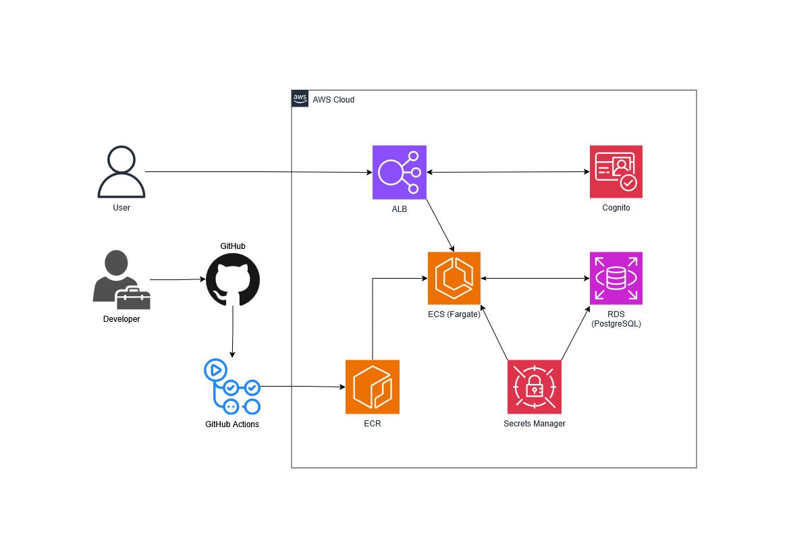

# Room Booking System

Enterprise meeting room booking API running on AWS. Handles room reservations with conflict detection and production-ready infrastructure.

## Features

- **Room Management**: Create, view, and delete meeting rooms
- **Booking System**: Reserve rooms with start/end times
- **Conflict Detection**: Prevents double-bookings with overlap validation
- **Availability Check**: Query room availability for specific time ranges
- **RESTful API**: Standard HTTP endpoints for all operations

## Architecture



- **Runtime**: ECS Fargate with Application Load Balancer
- **Database**: RDS PostgreSQL with AWS Secrets Manager
- **Container Registry**: ECR with lifecycle policies
- **Infrastructure**: Terraform-managed AWS resources

## Deployment

Deploy to AWS using Terraform:

```bash
cd terraform
terraform init
terraform plan
terraform apply
```

Get the application URL:

```bash
terraform output load_balancer_url
```

## API

### Rooms

- `GET /room` - list rooms
- `GET /room/{id}` - get room
- `POST /room` - create room
- `DELETE /room/{id}` - delete room
- `GET /room/{id}/availability?startTime=...&endTime=...` - check if available

### Bookings

- `GET /booking` - list bookings
- `GET /booking/{id}` - get booking  
- `POST /booking` - create booking
- `DELETE /booking/{id}` - delete booking

## Examples

Create room:

```bash
curl -X POST $(terraform output -raw load_balancer_url)/room -H "Content-Type: application/json" -d '{"name": "Room 101"}'
```

Book room:

```bash
curl -X POST $(terraform output -raw load_balancer_url)/booking -H "Content-Type: application/json" -d '{
  "room": {"id": 1},
  "startTime": "2025-07-06T10:00:00", 
  "endTime": "2025-07-06T11:00:00",
  "reservedBy": "John"
}'
```

## Schema

```txt
Room: id, name
Booking: id, room_id, start_time, end_time, reserved_by
```

Unique constraint on room names. Foreign key from booking to room.

## Notes

- Booking conflicts return 409
- Uses standard time overlap detection: `(startA < endB) && (startB < endA)`
